# Expense Calculator

A full-featured personal finance management app built with Flutter — track
income and expenses, manage budgets, automate recurring transactions, and
work entirely offline with optional one-tap sync to the cloud.

## Features

- **Income & Expense Tracking** — log transactions against custom,
  user-specific categories
- **Budgets** — set monthly/weekly/custom budgets per category or overall,
  with progress tracking
- **Spending Comparison** — compare income/expense across different periods
- **Recurring Transactions** — define rules (salary, rent, bills, etc.); the
  app surfaces due/upcoming occurrences for review instead of silently
  creating them, with bulk-apply, skip, and "run now" actions
- **Offline Mode** — register and use every feature without an account or
  internet connection, backed by a local (Drift/SQLite) database; sync
  everything to the cloud later in one step, whenever you're ready
- **Security** — session auto-lock with password or fingerprint
  (biometric) authentication
- **Dark Mode** — clean, modern UI with full light/dark theme support

## Tech Stack

- **Flutter** — cross-platform UI
- **Riverpod** — state management
- **Firebase** — Authentication, Cloud Firestore, Storage
- **Drift (SQLite)** — local, offline-first database
- **local_auth** — biometric authentication

## Screenshots

### Authentication

<table>
<tr>
<td align="center">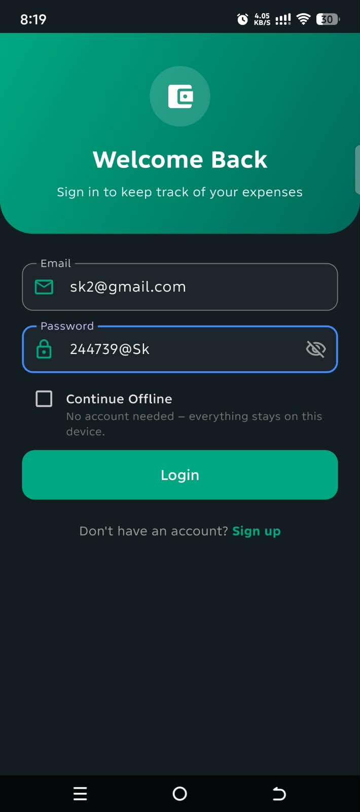<br/>Login</td>
<td align="center">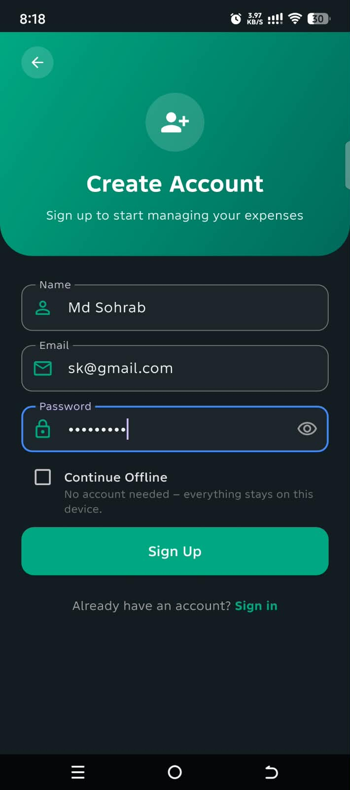<br/>Signup</td>
</tr>
</table>

### Dashboard

<table>
<tr>
<td align="center">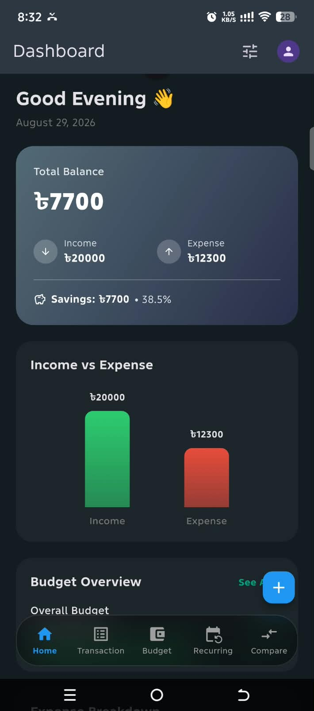<br/>Dashboard</td>
<td align="center">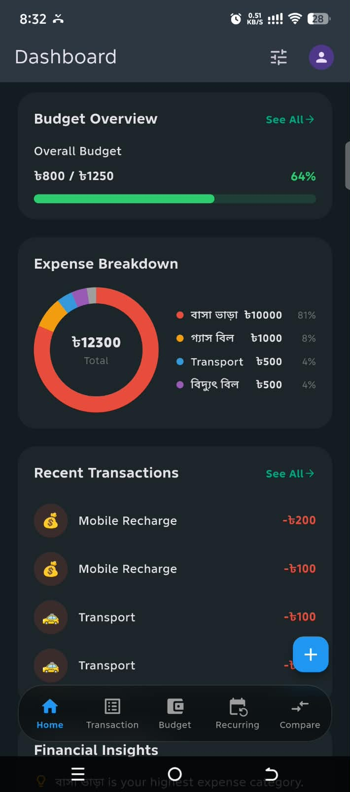<br/>Dashboard</td>
</tr>
</table>

### Transactions

<table>
<tr>
<td align="center">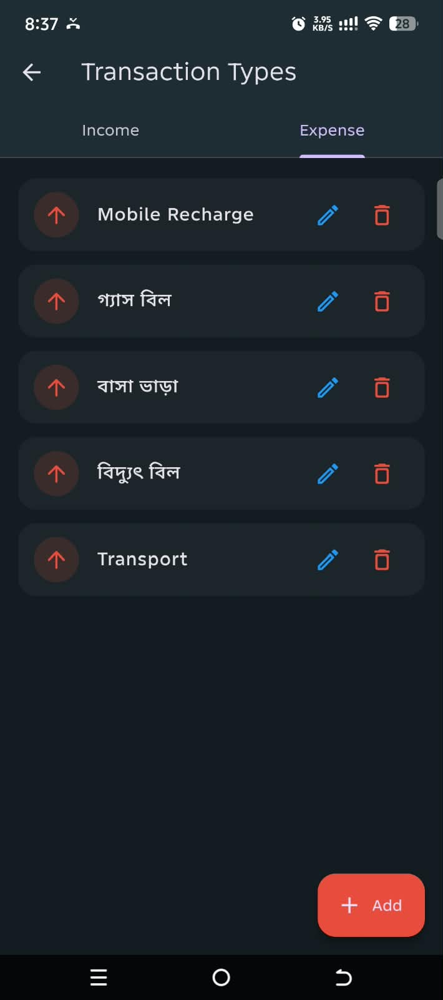<br/>Category Setup</td>
<td align="center">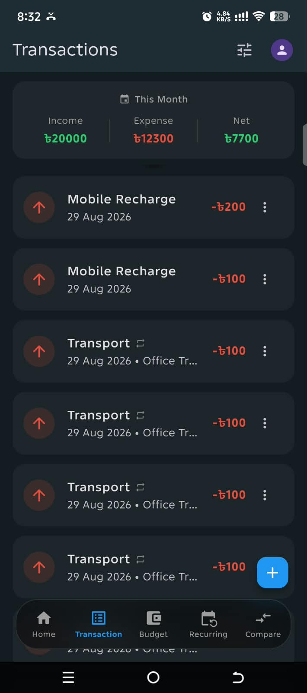<br/>Transactions</td>
<td align="center">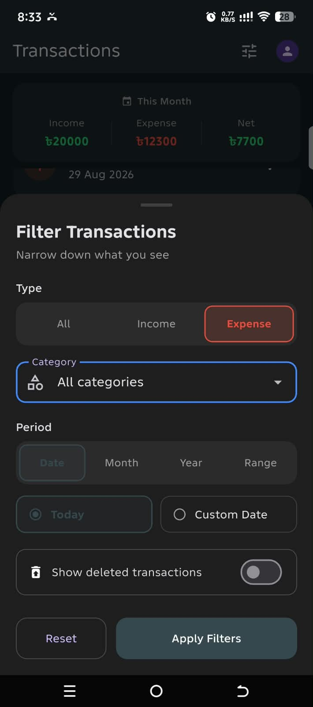<br/>Filter Options</td>
</tr>
</table>

### Budgets

<table>
<tr>
<td align="center">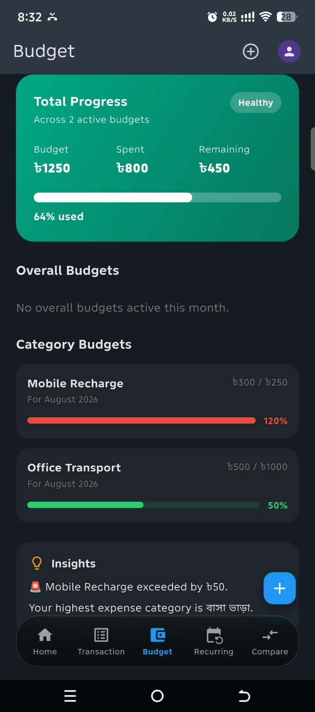<br/>Budget Dashboard</td>
<td align="center">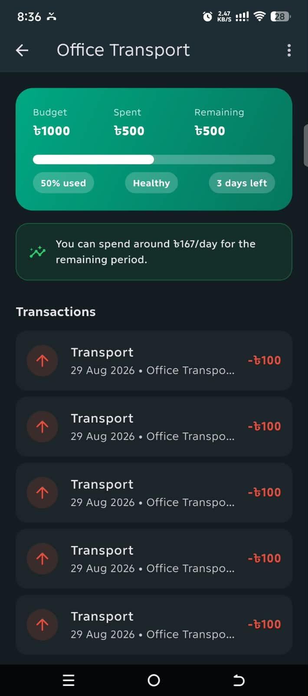<br/>Budget Details</td>
<td align="center">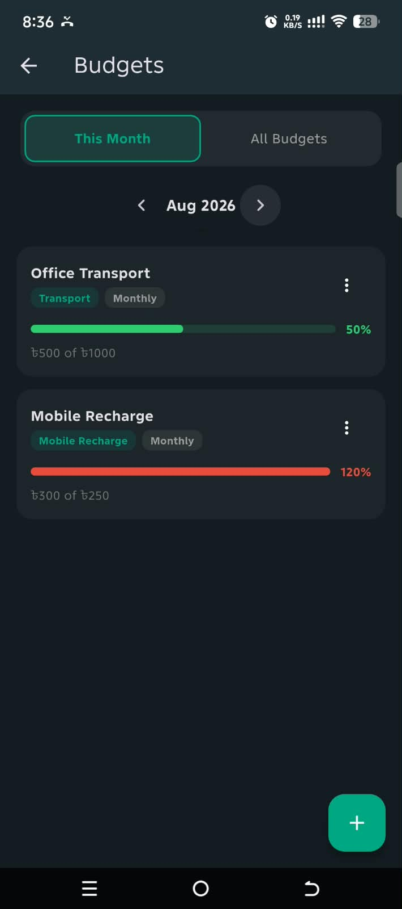<br/>Budget List</td>
</tr>
<tr>
<td align="center">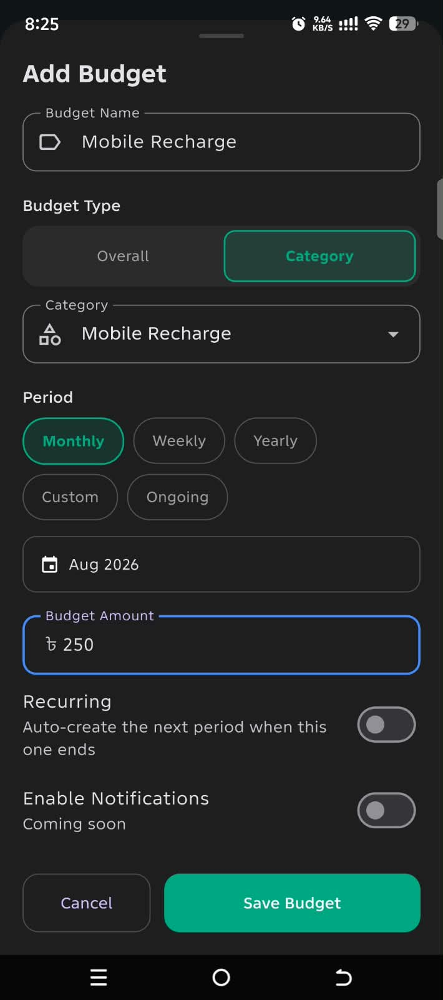<br/>Add New Budget</td>
</tr>
</table>

### Recurring Transactions

<table>
<tr>
<td align="center">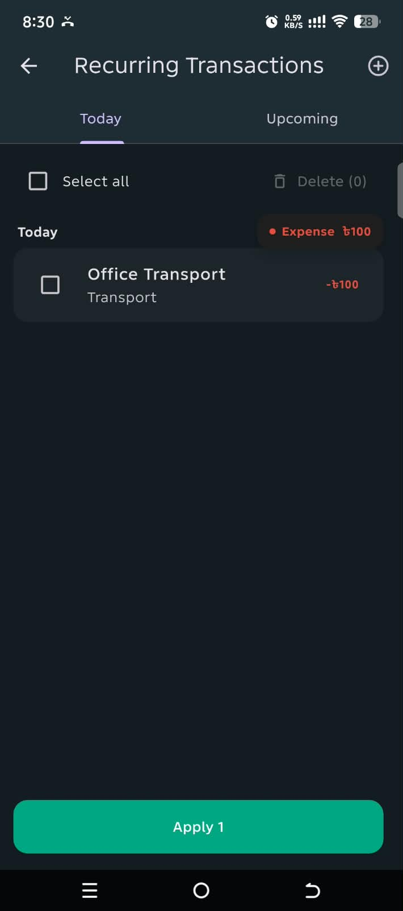<br/>Today Tab</td>
<td align="center">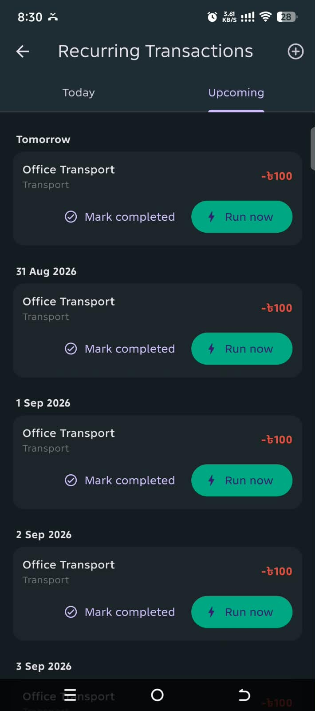<br/>Upcoming Tab</td>
<td align="center">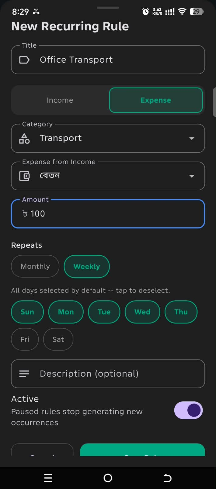<br/>New Rule</td>
</tr>
</table>

### Settings

<table>
<tr>
<td align="center">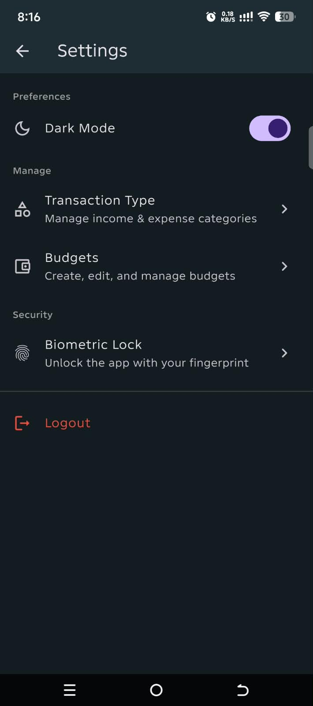<br/>Settings</td>
</tr>
</table>

## Getting Started

```bash
flutter pub get
dart run build_runner build --delete-conflicting-outputs
flutter run
```

For a signed production release build (APK + App Bundle):

```bash
scripts/build_release.sh
```
